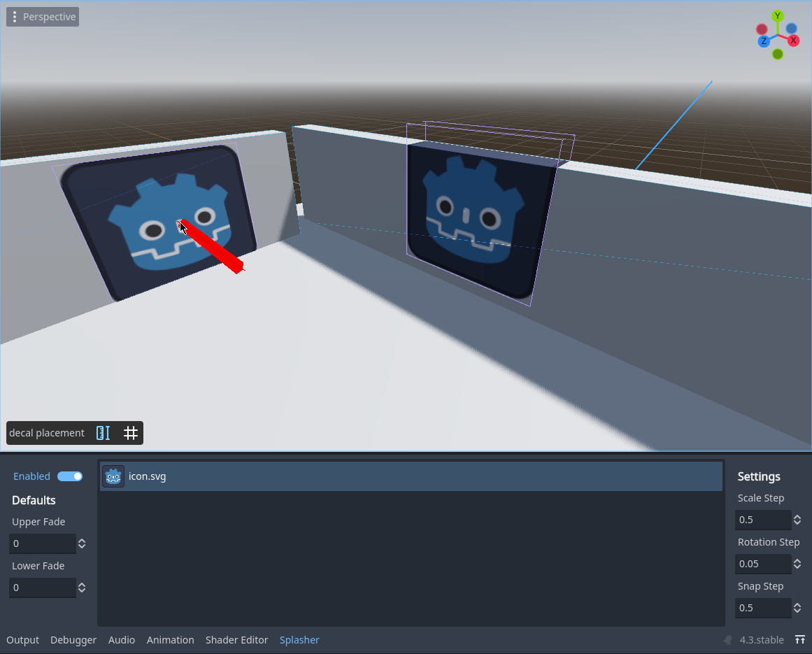

# Splasher (WIP)

### Godot addon for placing decals easily.

> [!NOTE]
> Supported engine versions: 4.3+

## How to use

Drag your texture into Splasher and select it.

Models must have collision shapes for this to work.

## Keybinds

> Shift + Mouse Wheel — rotate
>
> Ctrl + Mouse Wheel — scale
>
> LMB — place
