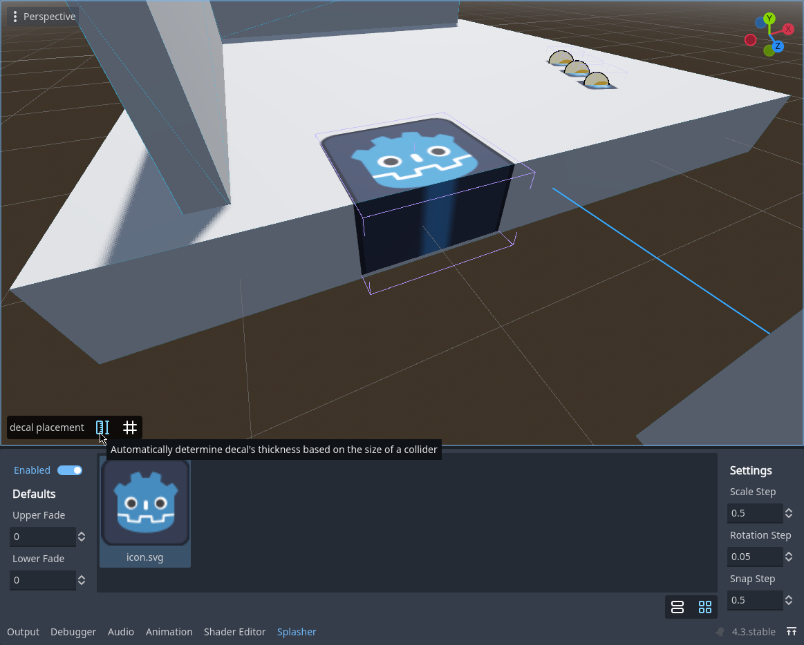
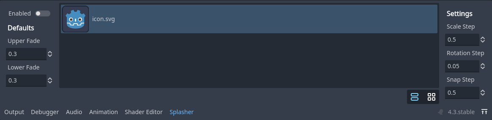
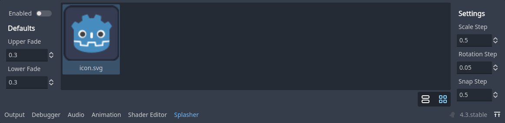

# Splasher (WIP)

### Godot addon for placing decals easily.

> [!NOTE]
> Supported engine versions: 4.3+

## Caveats

- Models must have collision shapes for this to work.
- Currently only albedo textures are supported.

## Features

### Works with both mesh instances and CSG geometry

### Auto detection of the collider thickness

### List/Grid view

## Keybinds (when in decal placement mode)

> Shift + Mouse Wheel — rotate decal
>
> Ctrl + Mouse Wheel — scale decal
>
> LMB — place decal
